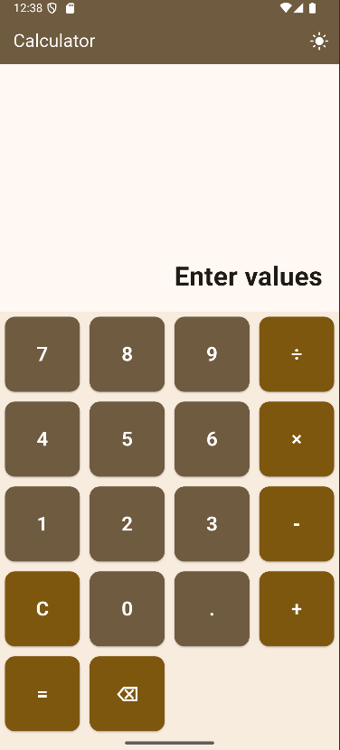
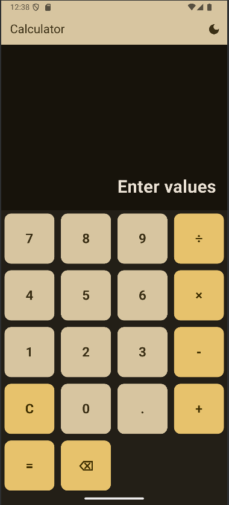
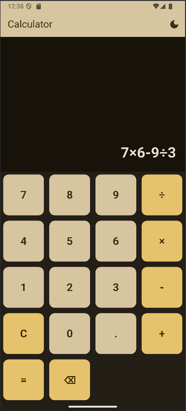

# Flutter Calculator App

A simple and elegant calculator built using Flutter.  
This project contains **two versions** of the calculator:
1. **Basic Calculator:** Works with two operands (e.g., 5 + 3).
2. **Advanced Calculator:** Supports multiple operations (e.g., 5 + 3 × 2).

---

## 🚀 Features
- Basic arithmetic operations (+, -, ×, ÷).
- Light & dark mode support.
- Responsive UI for different screen sizes.
- **Advanced mode:** Expression evaluation with operator precedence.

---
## Dependencies

This project uses the following Flutter packages:

- [math_expressions](https://pub.dev/packages/math_expressions): Used for parsing and evaluating mathematical expressions.
- [provider](https://pub.dev/packages/provider): Used for state management across the application.

---

## App Screenshot
|  |  |  |